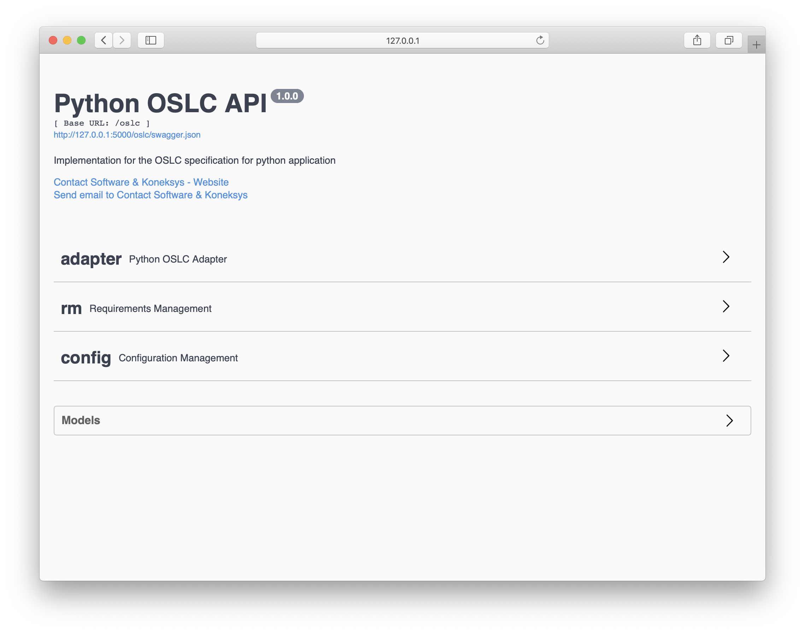

# PyOSLC SDK

> :warning: **Warning**
> 
> PyOSLC Announcement!
> 
> The PyOSLC SDK project is being improved!
> 
> The improvement will add some changes in the implementation of the SDK 
> to convert it into an OSLC Web Framework, this will change the way 
> to implement the API by adding better support for more data sources 
> by defining a neutral interface between OSLC API code, and data 
> source-specific access code. For adding a new data source, a developer 
> will only need to implement some adapter methods which are OSLC-independent. 
> This new behavior will allow us also to extend the domains in which 
> the API could work.
> 
> This improvements could represent some changes in the current version 
> that could affect your current implementation, our apologize in advance.


The `PyOSLC` project was developed as set of classes and libraries 
packaged as a SDK which is aimed to build REST-based API’s that allows us 
to implement `OSLC (Open Services for Lifecycle Collaboration) projects`
that meet the specifications for creating REST services to enable 
the interoperability of heterogeneous products and services.

## Getting Started

As part of the SDK project, there is an example that could be used to
demonstrate how to use the `PyOSLC SDK`.

### Getting the code.
To get the code of the `PyOSLC SDK` and the example project, it is necessary
to clone the project.

Using a git client this could be by executing.

```bash
$ git clone git@github.com:cslab/pyoslc.git
```

This command should create a new folder named `pyoslc` which contains the 
source code of the `PyOSLC SDK` project and the example.

### Configuring the environment
To execute the example it is necessary to install some dependencies,
it is also recommendable to use a virtual environment for doing it.

As far as the example concerned it assume the usage of 
[`virtualenvwrapper`](https://virtualenvwrapper.readthedocs.io/en/latest/)

For the example, let's create a virtual environment with the same name of 
the cloned folder: `pyoslc`

```bash
$ mkvirtualenv -python=`which python2.7` pyoslc
(pyoslc) $
```

Notice that after creating the virtual environment, this is activated.

### Installing dependencies
To install the dependencies required for the `PyOSLC SDK` and the example project
it should be used the `requirements.txt` file, that contains the list of 
dependencies.

```bash
(pyoslc) $ pip install -r requirements.txt
```

### Executing the PyOSLC Demo.
Having cloned the code and the virtual environment created it is time to execute
the `PyOSLC Demo`.

One step before, let's meet the structure of the project.

```
    ➜ tree pysolc
    ├── .env
    ├── .flaskenv
    ├── LICENSE
    ├── MANIFEST.in
    ├── README.md
    ├── app
    ├── examples
    ├── initialize.py
    ├── pyoslc
    ├── pyoslc_oauth
    ├── requirements.txt
    ├── setup.cfg
    └── setup.py 
```

| Folder          | Description                              |
| --------------- | ---------------------------------------- |
| `app`           | This folder contains the example project |
| `pyoslc`        | This is the SDK project that contains the class for developing an OSLC API |
| `pyoslc_oauth`  | An extension of the SDK project that contains the AuthN and AuthZ workflow |
| `examples`      | A set of values used in the example project to expose using the OSLC ApI   |

The `.env` and `.flaskenv` files are required to execute the example
project.

The content of the `.flaskenv` should be something like this:

```properties
FLASK_APP=app.wsgi.app
FLASK_ENV=development
FLASK_DEBUG=True
``` 

The `app.wsgi.app` is the module and app that should be execute when running
the Flask application.

The content of `.env` file should contain this line in case of running the
example project in localhost.

```properties
AUTHLIB_INSECURE_TRANSPORT=True
```

This value is required to avoid some validation for the implementation of 
the OAuth workflow, this line is only required if running in localhost or
in a development stage.

Once having the environment variables defined, it is time to execute the
application.

```shell script
$ cd app
$ flask run
* Serving Flask app "app.wsgi:app" (lazy loading)
* Environment: development
* Debug mode: on
* Running on http://127.0.0.1:5000/ (Press CTRL+C to quit)
* Restarting with stat
* Debugger is active!
* Debugger PIN: 234-758-391
```

Now it is possible to navigate to the [http://127.0.0.1:5000/oslc] 
to see the `PyOSLC Demo` running.

