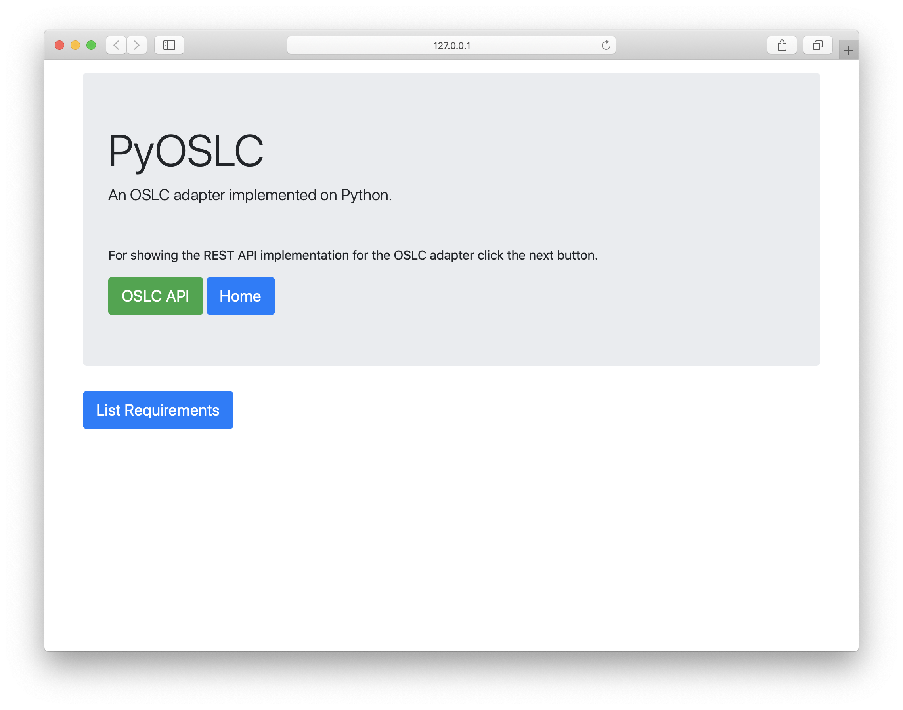

Getting Started.
================

Configuring the environment.
----------------------------
Before the end of the Python 2.7 support we had to decide which version of Python 
to work with. Knowing the differences between the 2.7 and 3.x versions and that 
we can not mix them in our projects, commonly we use a virtual environment for our projects.

There are different virtual environment managers, like `virtualenv`, `virtualenvwrapper`, 
`venv` and so on, no matter which of them to use, select one for creating the environment 
to install the dependencies for the project.

Creating the environment.
~~~~~~~~~~~~~~~~~~~~~~~~~
Here is a command to create the virtual environment using virtualenvwrapper.

.. code-block:: bash

    $ mkvirtualenv --python=`which python2.7` pyoslc
    (pyoslc) $

Note that the version of Python was passed as a parameter, in the `virtualenvwrapper` 
the default is Python 2.7, but this example shows how to specify a different version.

Installing dependencies.
------------------------
Once we have created the virtual environment we need to install the dependencies 
or the set of libraries required for the execution or development of the PyOSLC project.

Within the root folder of the PyOSLC project that was created when cloning the project 
there is a file called `requirement.txt` which lists these libraries.

::

    python-dotenv

    Flask==1.0.2
    Flask-CORS
    Flask-RESTx
    Flask-WTF
    Flask-Bootstrap
    Flask-SQLAlchemy
    Flask-Login

    RDFLib==5.0.0
    RDFLib-jsonld

    Authlib

    Werkzeug==0.16.1
    requests
    pytest

To install the libraries execute the next command.

.. code-block:: bash

    $ pip install -r requirements.txt

This command will take the name of each library listed in the `requirement.txt` file 
and will install it within the virtual environment. For some libraries in the 
`requirement.txt` file there is a specific version, the others will take the latest version 
for the library.

Executing the PyOSLC demo.
--------------------------
Having installed the dependencies, now it is possible to execute the demo application 
to show how the OSLC API works for exposing the endpoints of an specific domain application.

Since the PyOSLC SDK was developed using Flask and Flask-RESTx extension essentially, 
it is possible to use the Flask CLI to execute the application demo.

Flask prerequisites.
~~~~~~~~~~~~~~~~~~~~
Before the execution of the application demo, it is necessary to review the value of some 
parameters to ensure that the application will run correctly. Within the root folder 
of the project there are two files, `.env` and `.flaskenv`, these files are necessary 
for the execution of the demo.

.flaskenv
^^^^^^^^^
This file defines some parameters required for the usage of the Flask CLI to execute the application:

.. code-block:: properties

    FLASK_APP=app.wsgi.app
    FLASK_ENV=development
    FLASK_DEBUG=True

A deeper definition of these elements could be found in the documentation of Flask.

The value  ``app.wsgi.app`` for the FLASK_APP variable represents the module and 
name of the Flask application that we will execute, the first ``app`` is the name 
of the folder, ``wsgi`` is the name of the module and the latter ``app`` is the name 
of the Flask instance to be executed.

The other variables could be understood without more explanations.

.env
^^^^
Within this file it is possible to establish some environment variables that 
should be used for the execution of the application demo. 

For the demo or development purposes it is necessary to deactivate the validation 
of the SSL protocol for the usage of the Authlib unless the developer has the required 
certificates for the validations.

.. code-block:: properties

    AUTHLIB_INSECURE_TRANSPORT=True

The environment variable should be present with the value ``True`` if there are 
no SSL certificates, otherwise could be False or not present in the `.env` file.

Demo execution.
~~~~~~~~~~~~~~~
To execute the demo application we could use the Flask CLI.

.. code-block:: sh

    $ flask run
    * Serving Flask app "app.wsgi:app" (lazy loading)
    * Environment: development
    * Debug mode: on
    * Running on http://127.0.0.1:5000/ (Press CTRL+C to quit)
    * Restarting with stat
    * Debugger is active!
    * Debugger PIN: 234-758-391

This command will take the values setted in the environment variables to execute 
the application with the parameters specified, now it is possible to navigate to the app.

This application has been developed using Flask to make the web app, and Flask-RESTx extension 
to create the REST API.

Using the web app it is possible to access the data through the web page to see the information 
and the endpoints available in the API, the Flask-RESTx extension uses Swagger to auto document the API.

.. image:: _static/02.png

Using the OSLC API.
-------------------
There are different ways to use the OSLC API, but the most important and common way to use it 
is to send requests against the endpoints that will return the information stored within the specific 
domain application.

HTTP clients.
~~~~~~~~~~~~~
There are lots of HTTP clients for sending requests against an endpoint of an API, some of them are 
for the command line like `cURL`, or `httpie`, others are with GUI like `Postman` or `Insomnia`.

Since this demo is not for explaining how to use these clients, the `httpie` client will be used 
for the examples.

The Service Provider Catalog.
~~~~~~~~~~~~~~~~~~~~~~~~~~~~~
The main endpoint of an OSLC API is the ServiceProviderCatalog, for getting the information within 
this endpoint in the PyOSLC demo, it is necessary to send a request against the endpoint developed 
for this purpose.

Request:

.. code-block:: sh

    $ http http://127.0.0.1:5000/oslc/services/catalog accept:application/rdf+xml

Response:

.. code-block:: xml

    <?xml version="1.0" encoding="utf-8"?>
    <rdf:RDF
    xmlns:dcterms="http://purl.org/dc/terms/"
    xmlns:j.0="http://jazz.net/xmlns/prod/jazz/process/1.0/"
    xmlns:oslc="http://open-services.net/ns/core#"
    xmlns:rdf="http://www.w3.org/1999/02/22-rdf-syntax-ns#">
    <oslc:ServiceProviderCatalog rdf:about="http://127.0.0.1:5000/oslc/services/catalog">
        <oslc:domain rdf:resource="http://open-services.net/ns/rm#"/>
        <dcterms:title>Contact Software Platform Service Provider Catalog</dcterms:title>
        <oslc:serviceProvider rdf:resource="http://127.0.0.1:5000/oslc/services/provider/Project-1"/>
        <dcterms:description>A Service Provider for the Contact Software Platform.</dcterms:description>
        <oslc:domain rdf:resource="http://jazz.net/xmlns/prod/jazz/process/1.0/"/>

        ...

    </oslc:ServiceProviderCatalog>
    </rdf:RDF>

This response contains the definition of the ServiceProviderCatalog and the service providers 
defined within the OSLC API.

The Service Provider.
~~~~~~~~~~~~~~~~~~~~~
Within the ServiceProviderCatalog response it could be more than one service provider, 
remember that for each application or project of an specific domain application it is possible 
to have one service provider, in the next example it is shown how to retrieve the list of service 
for an specific project.

Request:

.. code-block:: sh
    
    $ http http://127.0.0.1:5000/oslc/services/provider/Project-1 accept:application/rdf+xml

Response Headers:

.. code-block:: http

    HTTP/1.0 200 OK
    Accept: application/rdf+xml
    Access-Control-Allow-Origin: *
    Content-Length: 4721
    Content-Type: application/rdf+xml
    Date: Thu, 03 Sep 2020 17:27:25 GMT
    OSLC-Core-Version: 2.0
    Server: Werkzeug/0.16.1 Python/2.7.16

Response Body:

.. code-block:: xml

    <?xml version="1.0" encoding="utf-8"?>
    <rdf:RDF
        xmlns:dcterms="http://purl.org/dc/terms/"
        xmlns:j.0="http://jazz.net/xmlns/prod/jazz/process/1.0/"
        xmlns:oslc="http://open-services.net/ns/core#"
        xmlns:rdf="http://www.w3.org/1999/02/22-rdf-syntax-ns#">
        <oslc:ServiceProvider rdf:about="http://127.0.0.1:5000/oslc/services/provider/Project-1">
            <dcterms:title rdf:datatype="http://www.w3.org/2001/XMLSchema#Literal">PyOSLC Service Provider for Project 1</dcterms:title>
            <oslc:details rdf:resource="http://127.0.0.1:5000/oslc/services/provider/Project-1"/>
            <dcterms:identifier rdf:datatype="http://www.w3.org/2001/XMLSchema#string">Project-1</dcterms:identifier>
            <dcterms:description>Service Provider for the Contact Software platform service (id: Project-1; kind: Specification)</dcterms:description>
        </oslc:ServiceProvider>
    </rdf:RDF>
    

The Services.
~~~~~~~~~~~~~
Depending on the domain specific application it is possible to have services to expose specific 
endpoints to retrieve data, create or use the information with other components of the OSLC like 
`QueryCapability`, `CreationFactory` and other components like `Selection` and `Creation` dialogs.

These services are also available within the OSLC API using the next endpoints.

Query:

.. code-block:: bash

    http GET http://127.0.0.1:5000/oslc/services/provider/Project-1/resources/requirement

Creation:

.. code-block:: bash

    http POST http://127.0.0.1:5000/oslc/services/provider/Project-1/resources/requirement

Selection Dialog:

.. code-block:: bash

    http GET http://127.0.0.1:5000/oslc/services/provider/Project-1/resources/selector

Creation Dialog:

.. code-block:: bash

    http GET http://127.0.0.1:5000/oslc/services/provider/Project-1/resources/creator

